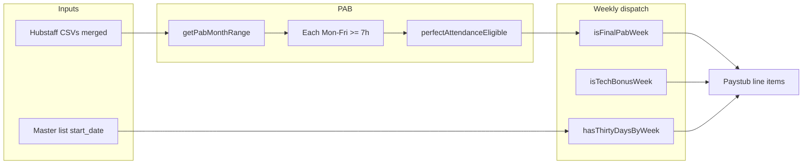

# Attendance & bonus calculator — reference and Simple HRIS mapping

This document describes how **Perfect Attendance Bonus (PAB)** and the **Technology Bonus** are calculated, how a payroll operator would use an external **Attendance Bonus Calculator** spreadsheet in principle, and how the same logic is implemented in the **Payroll Wizard** today.

## Reference spreadsheet

- **Expected path:** `references/Attendance Bonus Calculator.xlsx` (name may vary by casing).
- **Repo status:** The workbook was **not** present in the repository at the time this file was written (only a temporary Excel lock file `~$Attendance Bonus Calculator.xlsx` appeared). If your process relies on a specific **“How to Use This Sheet”** tab, paste that section below or add the `.xlsx` to `references/` so it stays versioned alongside this doc.

### Paste zone: “How to Use This Sheet” (from Excel)

<!-- When you have the workbook, copy the instructions from the sheet here verbatim. -->

_(Empty — add verbatim instructions from `Attendance Bonus Calculator.xlsx` → “How to Use This Sheet”.)_

---

## Equivalent workflow (what the spreadsheet is for)

Typical attendance bonus spreadsheets walk the user through:

1. **Pick the evaluation month** — the period in which every required workday must meet the hour threshold.
2. **Align daily hours** — one column (or row) per **Monday–Friday** in that period, using tracked time (e.g. Hubstaff export).
3. **Apply the rule** — mark each weekday **pass** if hours ≥ threshold (here **7 hours**), **fail** otherwise.
4. **Perfect attendance** — employee qualifies only if **every** Mon–Fri in the defined range passes.
5. **Amount** — if qualified, apply the fixed **Perfect Attendance Bonus** (in this product: **₱5,000** per eligible month, subject to weekly paystub gating below).

The **Technology Bonus** (₱1,850) is a separate monthly-cycle rule: service time + which **weekly** paycheck (by **Salary Date**) may carry it.

---

## Calculation rules (canonical for Simple HRIS)

Authoritative detail lives in [Documentation/BUSINESS_LOGIC.md](../reference/business-logic.md). Summary:

### Perfect Attendance Bonus (PAB)

| Item | Rule |
|------|------|
| Amount | **₱5,000** per eligible month (when actually paid on a paystub — see gating). |
| Threshold (standard) | **≥ 7 hours** per **Monday–Friday** in the PAB period — every weekday must pass. |
| Threshold (HSL dept) | **≥ 5 of the 7 Mon–Sun days** ≥ 7 h effective per week. Sat and Sun count independently. See HSL overnight rule below. |
| PAB period | Full “work month” bounded by **complete Mon–Sun weeks** whose **Monday** falls in the calendar month. **Start:** first Monday on or after the 1st. **End (standard):** Friday of the last in-month week. **End (HSL):** Sunday that closes the last Mon–Sun week (`hslAdjustedPabEnd`). |
| Data | Merged Hubstaff daily columns across **all** uploaded source files for the month; canonical columns (`monday` …) resolved to real dates using each file’s date range (filename). |

**Weekly paystub gating:** PAB is a **monthly** bonus but paystubs are **weekly**. It is only attached to the **final** weekly run whose pay period **ends on or after** the PAB period end date (`week.end ≥ pabMonthRange.end`). Earlier weeks in that month get **₱0** PAB even if the toggle would suggest otherwise at dispatch recomposition.

**HSL overnight shift rule.** Hubstaff records split hours when a shift crosses midnight (e.g. 1 h on Monday, 6 h on Tuesday for a single 7 h overnight). Both adjacent days are checked:

- **Forward (D is the overnight start):** D + D₊₁ ≥ 7 h → D qualifies.
- **Backward (D is the overnight tail):** D₋₁ + D ≥ 7 h → D qualifies (only when D₋₁ < 7 h on its own).

Both the start day and the tail day earn independent passing-day credits. Example: clocking in at 11 PM Monday and out at 6 AM Tuesday → **both Monday and Tuesday** count toward the 5-of-7 quota.

### Technology Bonus

| Item | Rule |
|------|------|
| Amount | **₱1,850**. |
| Service | **30 days** from `start_date` on the master list; no bonus before that. |
| Which paycheck | The weekly pay period whose **Salary Date** falls in the **3rd full Mon–Sun week** of that month. **Salary Date** = **Tuesday** = `week_start + 8 days` (Tuesday after the pay period’s Sunday). **Week 1** starts on the **first Monday on or after the 1st** of the month (so partial weeks before the 1st don't count); **Week 3** = Week 1 Monday + 14 days. **Exactly** that third week’s qualifying salary date — not week 4+. Per Carla (May 2026 meeting), this places tech bonus **two weeks out from PAB**. |
| Worked examples | **Mar 2026** (1st = Sun) → first full week Mar 2–8 → 3rd full week Mar 16–22 → salary Tue Mar 17 pays pay-period Mar 9–15. **May 2026** (1st = Fri) → first full week May 4–10 → 3rd full week May 18–24 → salary Tue May 19 ("week of the 22nd") pays pay-period May 11–17. **Jun 2026** (1st = Mon) → first full week Jun 1–7 → 3rd full week Jun 15–21 → salary Tue Jun 16 pays pay-period Jun 8–14. |
| Toggle | UI may show `tech_bonus`; **30-day rule is still enforced** at dispatch. |

---

## Where this is implemented in code

| Concern | Location |
|---------|----------|
| PAB month range, Mon–Fri counts, column dedupe | [src/lib/hubstaff/calendar-column-dedupe.ts](src/lib/hubstaff/calendar-column-dedupe.ts) — e.g. `getPabMonthRange`, `filterColumnGroupsByPabRange`, `groupDateColumnsByCalendarDay` |
| Merged month data for PAB, eligibility set, auto-toggle | [src/components/PayrollWizard.tsx](src/components/PayrollWizard.tsx) — `pabAllRows`, `perfectAttendanceEligible`, `weekdayColumnGroups`, `pabMonthColumnCoverageComplete` |
| **Step 5 — HSL Payroll: per-row PAB + Tech Bonus display and total** | `PayrollWizard.tsx` case 5 — `pabStatusByEmail.get(em)` (tri-state pill, ₱5,000 when eligible), `techBonusEligible.has(r.email)` (₱1,850); both included in row-level `totalPay` and footer grand total. PAB pill is clickable → PAB Calendar modal. |
| Dispatch: PAB final week, Tech week + 30 days, payload | `PayrollWizard.tsx` — `dispatchData` / `isFinalPabWeek`, `isTechBonusWeek`, `hasThirtyDaysByWeek`, `pay_php.perfect_attendance_bonus`, `pay_php.tech_bonus` |
| Employee-facing calendar / pending state | [src/components/employee/EmployeeDashboard.tsx](src/components/employee/EmployeeDashboard.tsx) |
| Aggregated metrics | [src/components/Overview.tsx](src/components/Overview.tsx) |

Bonus amounts are still duplicated in code (`COMMON_BONUSES` in PayrollWizard vs local constants in EmployeeDashboard). The intended fix is a shared module — see **Pending code change** below.

---

## Implementation plan — integrating with the Payroll Wizard

What is **already** integrated:

- **Step 1 — Upload:** Hubstaff CSVs feed merged rows/columns used for PAB.
- **Step 3 — Additions:** Common bonuses include **Perfect Attendance** and **Technology**; PAB eligibility is computed from merged data and reflected in toggles and per-day UI.
- **Step 5 — HSL Payroll:** PAB (tri-state pill, ₱5,000 when eligible) and Tech Bonus (₱1,850) are shown per HSL employee and **included in Total Pay**. Same eligibility sets (`pabStatusByEmail`, `techBonusEligible`) as regular employees; PAB uses Mon–Sun week logic for HSL.
- **Step 6 — Dispatch:** Bonuses are **recomposed** so weekly paystubs get **gated** PAB/Tech amounts; payload includes `pab_evaluation` range and pay lines.

Recommended **next steps** (if you want parity with a spreadsheet or clearer ops):

1. **Version the reference `.xlsx`** in `references/` and fill the **Paste zone** at the top of this doc with the exact “How to Use This Sheet” text. Reconcile any difference between Excel and `BUSINESS_LOGIC.md`.
2. **Single source of truth for amounts** — apply the **Pending code change** below (or run the same refactor in Agent mode if Plan mode blocks edits).
3. **Optional wizard UX** — add a short **“How bonuses are calculated”** collapsible in Step 3 linking to this file or in-app bullets (PAB 7h × Mon–Fri, final week only; Tech = 3rd week salary date + 30 days).
4. **QA checklist** — for a given month, compare spreadsheet output vs wizard eligibility for 2–3 sample employees before go-live.

### Pending code change — `src/lib/payroll/constants.ts`

Deduplicate **₱5,000** / **₱1,850** per [Documentation/problem.md](../notes/problem.md):

1. Add `src/lib/payroll/constants.ts` exporting `PERFECT_ATTENDANCE_BONUS_PHP = 5000` and `TECHNOLOGY_BONUS_PHP = 1850`.
2. In [src/components/PayrollWizard.tsx](src/components/PayrollWizard.tsx), import those constants and use them in `COMMON_BONUSES` and in the Step 3 intro copy (replace hardcoded “₱1,850” / “₱5,000” strings with `formatPHP(...).replace(/\.\d{2}$/, '')` so labels stay in sync).
3. In [src/components/employee/EmployeeDashboard.tsx](src/components/employee/EmployeeDashboard.tsx), remove the local `PERFECT_ATTENDANCE_BONUS_PHP` / `TECHNOLOGY_BONUS_PHP` lines and import from `@/lib/payroll/constants`.

*(This refactor was not applied automatically while Cursor Plan mode restricted edits to markdown files.)*

---

## Diagram — bonus flow vs weekly payroll

---

*Last updated: 2026-04-16. Update the paste zone when the reference workbook is available. Re-run the pending code change in Agent mode if you want the shared constants file applied.*
